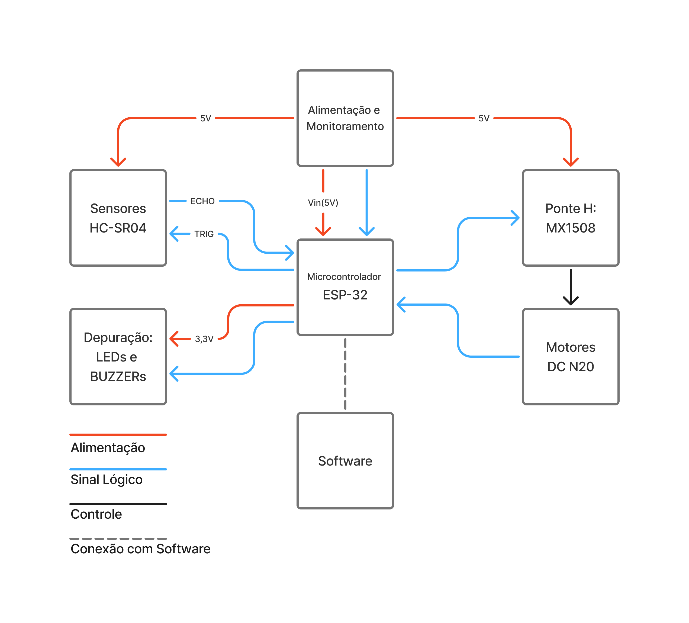
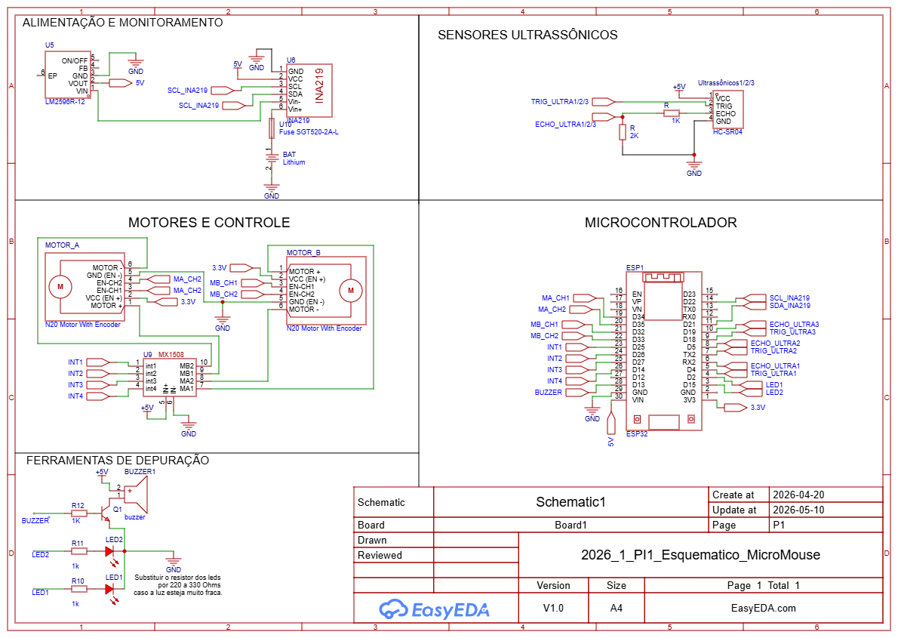

# _Hardware_

Esta pasta deverá armazenar arquivos referentes a:

- Simulações de circuitos eletrônicos (alimentação, sensores, atuadores etc.): [Qucs](https://qucs.sourceforge.net/), [QSPICE](https://www.qorvo.com/design-hub/design-tools/interactive/qspice), [Fritzing](https://fritzing.org/), dentre outros.
- Esquemáticos de circuitos: [KiCad](https://www.kicad.org/), Qucs, QSPICE.
- Diagramas de bloco: [Canva](https://www.canva.com/pt_br/), [TikZ](https://tikz.net/).
- _Datasheets_ de componentes eletrônicos, microcontroladores, _shields_ Arduino, motores etc.
- Testes tabelados de circuitos: arquivos CSV, Excel.
- Imagens PNG e JPEG de resultados práticos: fotos de testes reais, gráficos de resultados etc.
- Outros arquivos referentes ao _hardware_ do projeto.

## Resumo do hardware

O micromouse utiliza o ESP32 como unidade de processamento, com sensores ultrassônicos HC-SR04 (com divisores de tensao nos pinos ECHO) para percepcao do labirinto, motores DC N20 com encoders e a ponte H MX1508 para controle de tração diferencial. A alimentação e feita por bateria Li-ion 12V (3x18650), com regulação para 5V via LM2596 e monitoramento por INA219. Para depuração, há LEDs e buzzer acionado por transistor NPN.

Imagens e diagramas do conjunto:

- [desenhos/esquematico-hardware.pdf](desenhos/esquematico-hardware.pdf)

links:
- [datasheets dos componentes](./datasheets/)
- [Esquemático no EasyEDA](https://u.easyeda.com/join?type=project&key=44e9d3ebed6c2279ee6d0f05779d2542&inviter=554e5a4f483248f6ab2e15cfd64a4707)

> **[!AVISO!]**
>> **Não acrescente código-fonte a esta pasta.** O código desenvolvido para microcontroladores e SOCs ([Arduino](https://www.arduino.cc/), [ESP32](https://www.espressif.com/), [Raspberry Pi](https://www.raspberrypi.com/)) deverá ser armazenado na pasta [src/firmware](https://github.com/fcte-pi1/template/tree/main/src/firmware) deste repositório.
